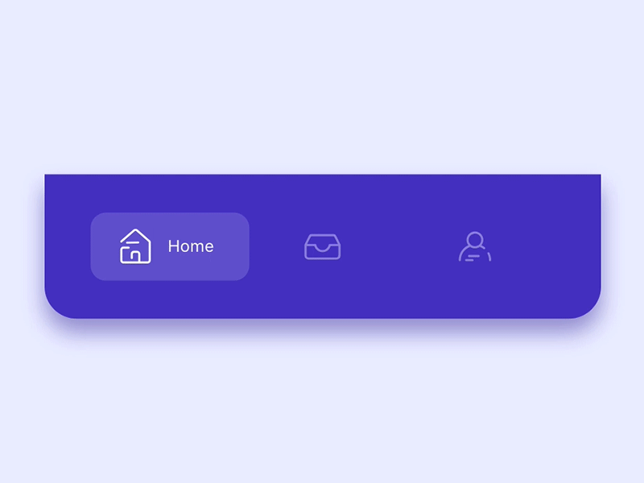

# SmoothTabBar



# Installation
- Drag & drop source folder in your project directory.


# 1) Create TabItem Model like below that return [ViewController]

- TabItem model return Tab with Image, without Image & tabName

```swift
let v1 = ViewController()
TabItem(v1, imageName: "home", tabName: "Home")

// v1 stands for ViewController
// pass image name as String
// pass tabName as String

func smoothTab() -> [TabItem] {
  let v1 = HomeViewController(nibName: "HomeViewController", bundle: nil)

  let v2 = HomeViewController(nibName: "HomeViewController", bundle: nil)

  let v3 = HomeViewController(nibName: "HomeViewController", bundle: nil)

  let v4 = HomeViewController(nibName: "HomeViewController", bundle: nil)

  
  let t1 = TabItem(v1, imageName: "home", selectedImage: nil, tabName: nil)
  let t2 = TabItem(v2, imageName: "search", selectedImage: nil, tabName: nil)
  let t3 = TabItem(v3, imageName: "cart", selectedImage: nil, tabName: nil)
  let t4 = TabItem(v4, imageName: "profile", selectedImage: nil, tabName: nil)
  
  return [t1,t2,t3,t4]
}
```

## 2) Set MagicTabBarViewController as rootViewController in didFinishLaunchingWithOptions

```swift
window = UIWindow(frame: UIScreen.main.bounds)
let tab = AppTabBarViewController.init(nibName: "AppTabBarViewController", bundle: nil, smoothData: smoothTab())
window?.rootViewController = tab
window?.makeKeyAndVisible()
```

# Now Boommmmm & Run. Your one star give me a lot inspiration.

- For More Info... Download Project and check all stuff configuration in AppDelegate


<a href="https://www.paypal.com/cgi-bin/webscr?cmd=_xclick&business=XAYQKAT69SRME&lc=NZ&item_name=Buy%20me%20a%20coffee&amount=3%2e00&currency_code=USD&button_subtype=services&bn=PP%2dBuyNowBF%3abtn_buynowCC_LG%2egif%3aNonHosted" target="_blank"></a>
